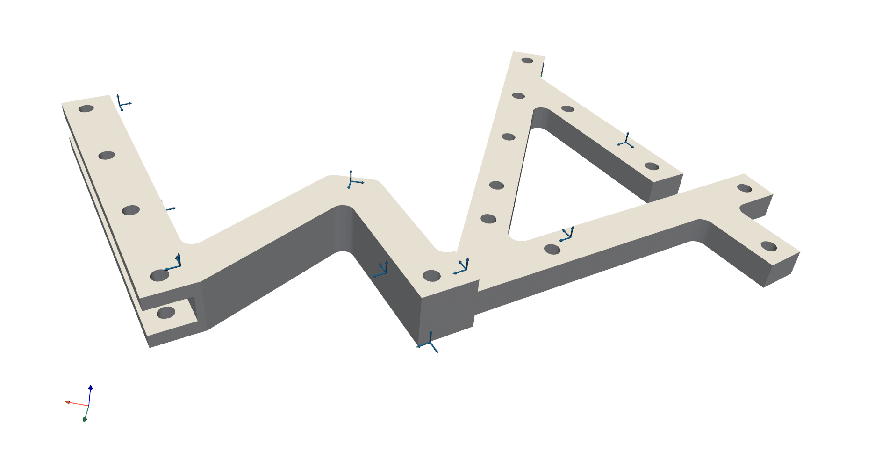

##########
3D Display
##########

The :mod:`pyFBS` can be used for 3D visualization. The 3D display enables depiction of structures, sensors, impacts, channels and virtual points in a simple and intuitive, Pythonic manner. 
Furthermore, the 3D display supports motion animation, where objects or mode shapes can be animated with ease. For the 3D visualization a python package `PyVista <https://docs.pyvista.org/index.html>`_ is used.

.. note:: 
   Download example showing the basic use of the 3D display: :download:`01_static_display.ipynb <../../examples/01_static_display.ipynb>`

To open a blank 3D display simply make an instance of the :class:`pyFBS.view3D`.

.. code-block:: python

	view3D = pyFBS.view3D()

A rendering window will open in the background, which will not pause the code execution (for more details refer to the :class:`pyvista.BackgroundPlotter`). By default a coordinate system is placed in the origin and an orientation marker is placed in the bottom-left corner. 

*****************
Geometric objects
*****************
Geometric objects can be added to the 3D display in a simple manner. For simple objects (cylinders, spheres, boxes, ...) `PyVista methods <https://docs.pyvista.org/examples/00-load/create-geometric-objects.html#sphx-glr-examples-00-load-create-geometric-objects-py>`_ 
can be used for the geometry generation. For displaying a more complex geometric objects a STL file can be loaded in the 3D display (example datasets can be downloaded with :func:`pyFBS.download_lab_testbench`).

.. code-block:: python
 
	path_to_stl = r"./lab_testbench/STL/A.stl"
	view3D.add_stl(path_to_stl,name = "AB")

After the code execution the geometric object will apear in the rendering window.

Multiple geometric objects can be added to the display with different colors and even opacity (checkout :func:`pyvista.BackgroundPlotter.add_mesh` for all options). 
When adding multiple geometric objects, care should be taken that different ``name`` variable is provided, otherwise the object with the same name will be overwritten (discarded from the 3D display). 
   
***********
I/O Objects
***********
In the 3D display accelerometers, channels, impacts and virtual points can be shown. The positional and orientation information for each separate degree of freedom is defined in a :mod:`pandas.DataFrame`. 

Accelerometers
==============
Accelerometers can be added to 3D display directly from the :mod:`pd.DataFrame`.

.. code-block:: python

	path_to_xlsx = r"./lab_testbench/Measurements/AM_measurements.xlsx"
	
	df_acc = pd.read_excel(path_to_xlsx, sheetname='Sensors_AB')
	view3D.show_acc(df_acc)

After the code execution accelerometers will be shown in the 3D display.

Channels
========
Channels associated with accelerometers can be added to the 3D display directly from the :mod:`pd.DataFrame`.

.. code-block:: python

	df_chn = pd.read_excel(path_to_xlsx, sheetname='Channels_AB')
	view3D.show_chn(df_chn)

After the code execution channels will be shown in the 3D display.	

Impacts
=======
Impacts can be added to the 3D display directly from the :mod:`pd.DataFrame`.

.. code-block:: python

	df_imp = pd.read_excel(path_xlsx, sheetname='Impacts_AB')
	view3D.show_imp(df_imp)

After the code execution impacts will be shown in the 3D display.	

Virtual points
==============
Virtual points can also be added to the 3D display directly from the :mod:`pd.DataFrame`.

.. code-block:: python

	df_vps = pd.read_excel(path_xlsx, sheetname='VP_Channels')
	view3D.show_vp(df_vps)

After the code execution virtual points will be shown in the 3D display.	
	

Labels
======
Accelerometer, channels, impacts and virtual points can also be labeled or enumerated based on the information from the corresponding :mod:`pd.DataFrame`.

.. code-block:: python

	view3D.label_acc(df_vps)
	view3D.label_chn(df_chn)
	view3D.label_imp(df_imp)
	view3D.label_vp(df_vps)

Corresponding labels will appear in the 3D display after the code execution.

   
*******************************
Interaction with the 3D display
*******************************
Basic interaction with the 3D display is relatively simple. Mouse ``left-click`` can be used to rotate the rendering scene and ``middle-click`` to pan the rendering scene. 
For more information refer to the `PyVista plotting shortcuts <https://docs.pyvista.org/plotting/plotting.html>`_.

.. figure:: ./data/interaction.gif
   :width: 800px
