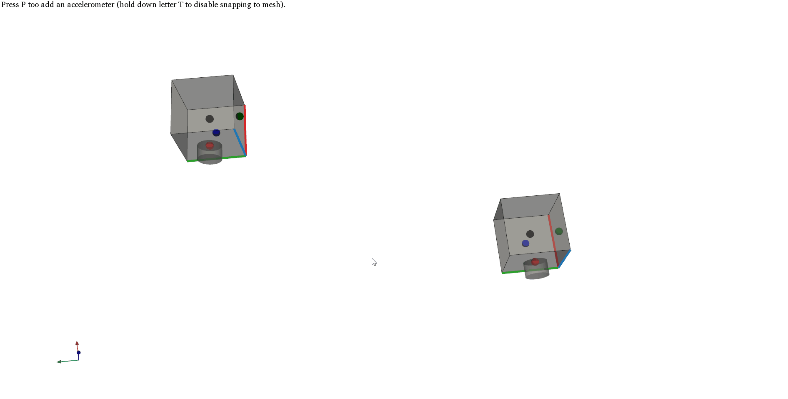

=======================
Interactive positioning
=======================
With the :mod:`pyFBS` accelerometers, impacts and virtual points can be added and positioned interactively within the 3D display. 

.. note:: 
   Example showing the interactive positioning: :download:`02_interactive_display.ipynb <../../examples/02_interactive_display.ipynb>`.

Dynamic interaction with objects in the :mod:`pyFBS` is achieved with the sphere widgets from PyVista. 
Altogether four sphere widgets are used (one for translation and three for rotations).
   
***********
Translation
***********
Translation of an object in the 3D display can be performed by moving a black sphere widget. An example of translation in the 3D display is depicted on a GIF bellow.

********
Rotation
********
To rotate an object in the 3D display, three sphere widgets are available, for rotation around each axis. 
Red sphere widget is used for rotation around `X`-axis, green for rotation around `Y`-axis and blue for rotation around `Z`-axis. An example of rotation in the 3D display is depicted on a GIF bellow.

********
Snapping
********
If a mesh from an STL file is available there is possible to snapp the position of the object to the surface of the geometric object.
Furthermore, also the orientation of the object is alligned with the surface normal in the snapping point. The snapping option can be disabled by holding down the letter ``T`` 
when moving the object in the 3D display.

***********
I/O Objects
***********
If a predefined dataset :mod:`pandas.DataFrame` is available for accelerometers, impacts and virtual points it can be used to place interactive objects already on the predefined positions.

Accelerometers
==============   
To enable the snapping to mesh option, first load an STL file in the 3D display:

.. code-block:: python

	stl = r"./lab_testbench/STL/A.stl"
	mesh = view3D.add_stl(stl,name = "ts")

Accelerometers can then be placed on the predefined positions, which can then be moved around and rotated in the 3D display. 
If there is no predefined data, new accelerometers can be added to the 3D display by pressing the letter ``P``.
	
.. code-block:: python

	view3D.add_acc_dynamic(mesh,predefined = df_sensors)

The new updated positions and orientations can be obtained directly from the :class:`pyFBS.view3D`:

.. code-block:: python

	df_acc_updated = view3D.get_acc_data()

Channels
========   

Channels can be defined based on the positions and orientations of accelerometers.

.. code-block:: python

	df_chn_updated = pyFBS.utility.generate_channels_from_sensors(df_acc_updated)

Currently, all the accelerometers are considered to be tri-axial. However, possible redundant channels can simply be discarded from the ``df_chn_updated``.

Impacts
=======

Interactive impacts can be added also from the predefined positions.

.. code-block:: python

	view3D.add_imp_dynamic(mesh,predefined = df_impacts)
	
The updated positions and orientations can be obtained directly.	

.. code-block:: python

	df_imp_updated = view3D.get_imp_data()

Virtual points
==============

In a simmilar manner also interactive virtual points can be added to the 3D display.

.. code-block:: python

	view3D.add_vp_dynamic(mesh,predefined = df_vp)

The updated positions and orientations can be obtained directly.

.. code-block:: python

	df_vp_updated = view3D.get_vp_data()

************************
Export updated positions
************************
The updated datasets can be exported to Excel file in a simple manner with the ``pd.ExcelWriter``.

.. code-block:: python
 
	with pd.ExcelWriter('./output_file.xlsx') as writer:  
		df_acc_updated.to_excel(writer, sheet_name='Sensors',index = False)
		df_imp_updated.to_excel(writer, sheet_name='Impacts',index = False)
		df_chn_updated.to_excel(writer, sheet_name='Channels',index = False)

