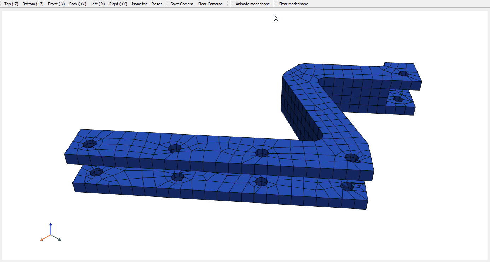
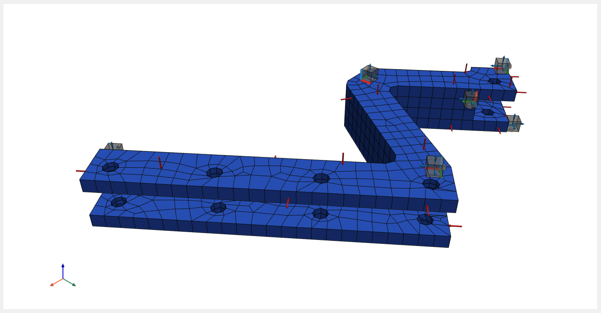
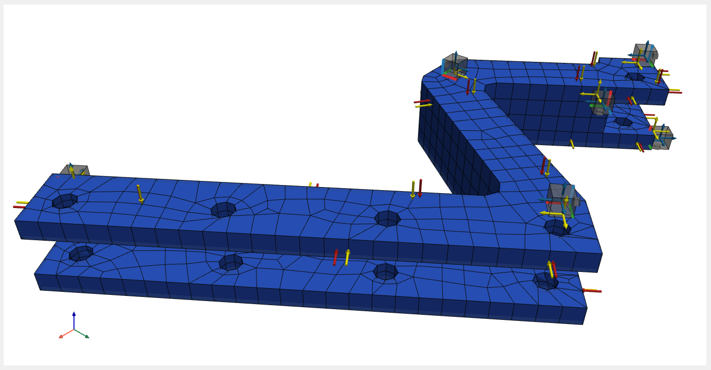
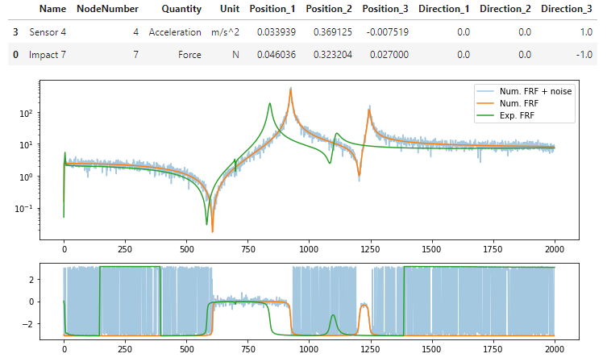

==================
FRF synthetization
==================
In the :mod:`pyFBS` modal analysis and FRFs synthetization, can be performed based on the mass  and stiffness matrices imported from the FEM software. Currently, only data import from Ansys is supported. 

.. note:: 
   Download example showing the basic use of the FRF synthetization: :download:`03_FRF_synthetization.ipynb <../../examples/03_FRF_synthetization.ipynb>`

The mass and stiffness matrices contain the information about the mass and stiffness distribution of the dynamic system. 
By solving the eigenvalue problem, the eigenfrequencies and eigenvectors of the system are determined. 
Calculated eigenvectors can be animated with ease. 
For the FRF synthetization mode superposition method is used.
   
MK model initialization
***********************

First, we initialize the MK model (with class :class:`pyFBS.MK_model`) by importing ``.rst`` and ``.full`` files, 
which cointain the information on the locations of finite element nodes, their DoFs, the connection between the nodes, 
the mass and stiffness matrix of the system.

.. code-block:: python

    full_file = r"./lab_testbench/FEM/B.full"
    rst_file = r"./lab_testbench/FEM/B.rst"

    MK = pyFBS.MK_model(rst_file, full_file, no_modes = 100, allow_pickle = False, recalculate = False)

In this step also the eigenfrequencies and eigenvectors of the system are simultaneously calculated. The number of calculated eigenvalues is limited by the ``no_modes`` parameter.

Mode shape visualization
************************

After the MK model is defined, the calculated mode shapes can be animated. You can also add an STL file to visualize the undeformed shape of the structure.

.. code-block:: python

    stl = r"./lab_testbench/STL/B.stl"
    view3D = pyFBS.view3D(show_origin= True)
    view3D.add_stl(stl,name = "engine_mount",color = "#8FB1CC",opacity = .1)   

Then the finite element mesh is added, which is afterwards used for mode shape animation.

.. code-block:: python

    view3D.plot.add_mesh(MK.mesh, scalars = np.ones(MK.mesh.points.shape[0]), cmap = "coolwarm", show_edges = True)

Mode shape can be selected with the method ``get_modeshape``. 
Parameters of animation are defined with the function ``dict_animation``, which is imported from :mod:`pyFBS.utility`. 
Here you can set the frames per second (``fps``), relative scale of deformation (``r_scale``) and the number of points in the animation sequence (``no_points``).

.. code-block:: python

    select_mode = 6
    _modeshape = MK.get_modeshape(select_mode)

    mode_dict = dict_animation(_modeshape,"modeshape",pts = MK.pts, mesh = MK.mesh, fps=30, r_scale=10, no_points=60)
    view3D.add_modeshape(mode_dict,run_animation = True)

   Animation of 7th mode shape.

   

To show undeformed mesh you can simply click the button in the popup window or call a method :func:`clear_modeshape()`:

.. code-block:: python

    view3D.clear_modeshape()

Visualization of impacts and responses
======================================

Locations and directions of impacts and responses must be passed with a :mod:`pd.DataFrame`. 

.. code-block:: python

    # Path to .xslx file
    xlsx = r"./lab_testbench/Measurements/AM_measurements.xlsx"

    # Import and show locations of accelereometers
    df_acc = pd.read_excel(xlsx, sheet_name='Sensors_B')
    view3D.show_acc(df_acc,overwrite = True)

    # Import and show directions of accelereometers channels
    df_chn = pd.read_excel(xlsx, sheet_name='Channels_B')
    view3D.show_chn(df_chn)

    # Import and show locations and directions of impacts
    df_imp = pd.read_excel(xlsx, sheet_name='Impacts_B')
    view3D.show_imp(df_imp,overwrite = True)

   

Defining DoFs of synthetized FRFs
*********************************

FRFs can currently only be synthetized at the nodes from the numerical model. 
Therefore, it is necessary to find the nodes closest to the desired locations in the numerical model and update them. 
The orientation of the generated FRFs is independent of the direction in the numerical model and will not change with the updated location.

Locations of impacts and channels can be updated to the nodes of the numerical model with the :func:`pyFBS.MK_model.update_locations_df`:

.. code-block:: python

    df_chn_up = MK.update_locations_df(df_chn)
    df_imp_up = MK.update_locations_df(df_imp)

Updated locations can also be displayed in the 3D display. 

.. code-block:: python

    view3D.show_chn(df_chn_up, color = "y", overwrite = False)
    view3D.show_imp(df_imp_up, color = "y", overwrite = False)

   
   Visualization of updated locations of impacts and channels with a yellow color.

FRF synthetization
******************

FRFs are synthetized at given locations and directions in ``df_channel`` and ``df_impact`` parameters. 
Even if we forget to define updated response and excitation locations, the function will automatically find 
the nearest nodes in the numerical model from which the FRFs are then synthetized. 
Frequency properties are defined in parameters ``f_start``, ``f_end`` and ``f_resolution``. 
The number of modes that will be considered in the synthetization is defined in the ``no_modes`` parameter 
and coeficient of modal dampling is defined in parameter ``modal_damping``.
The resulting FRFs can be in the form of ``accelerance``, ``mobility`` or ``receptance``, 
which is defined in the ``frf_type`` parameter.

.. code-block:: python

    MK.FRF_synth(df_channel = df_chn, df_impact = df_imp, 
                 f_start = 0, f_end = 2000, f_resolution = 1, 
                 limit_modes = 50, modal_damping = 0.003, 
                 frf_type = "accelerance")

The DoFs in the FRF matrix row follows the order of responses in the ``df_channel`` parameter, 
and the DoFs column matches the order of excitations in ``df_impact``.

Adding noise
============

To analyze various real-life experiments, numerically obtained FRFs are often on purpose contaminated with a random noise to follow experimental data. 
Noise can be added to FRFs by the ``add_noise`` method.

.. code-block:: python

    MK.add_noise(n1 = 2e-1, n2 = 2e-1, n3 = 5e-2 ,n4 = 5e-2)

FRF visualization
=================

An experimental measurement is also imported to compare the two FRFs.

.. code-block:: python

    exp_file = pyFBS.example_lab_testbench["meas"]["Y_B"]

    freq, Y_B_exp = np.load(exp_file,allow_pickle = True)

When visualizing FRFs, responses and excitation locations can also be displayed in the form of an organized table.

.. code-block:: python

    plt.figure(figsize = (12,8))

    s1 = 3
    s2 = 0

    param = ["Name" ,"NodeNumber", "Quantity", "Unit",
             "Position_1", "Position_2", "Position_3", 
             "Direction_1", "Direction_2", "Direction_3"]
    df_disp = df_chn.iloc[[s1]][param].copy()
    display(df_disp.append(df_imp.iloc[[s2]][param]))

    plt.subplot(211)
    plt.semilogy(MK.freq,np.abs(MK.FRF_noise[:,s1,s2]), alpha=0.4, label = "Num. FRF + noise")
    plt.semilogy(MK.freq,np.abs(MK.FRF[:,s1,s2]), label = "Num. FRF")
    plt.semilogy(freq,np.abs(Y_B_exp[s1,s2]), label = "Exp. FRF")
    plt.legend()

    plt.subplot(413)
    plt.plot(MK.freq,np.angle(MK.FRF_noise[:,s1,s2]), alpha=0.4)
    plt.plot(MK.freq,np.angle(MK.FRF[:,s1,s2]))
    plt.plot(freq,np.angle(Y_B_exp[s1,s2]))

	
Comparison of different FRFs.
	

   
