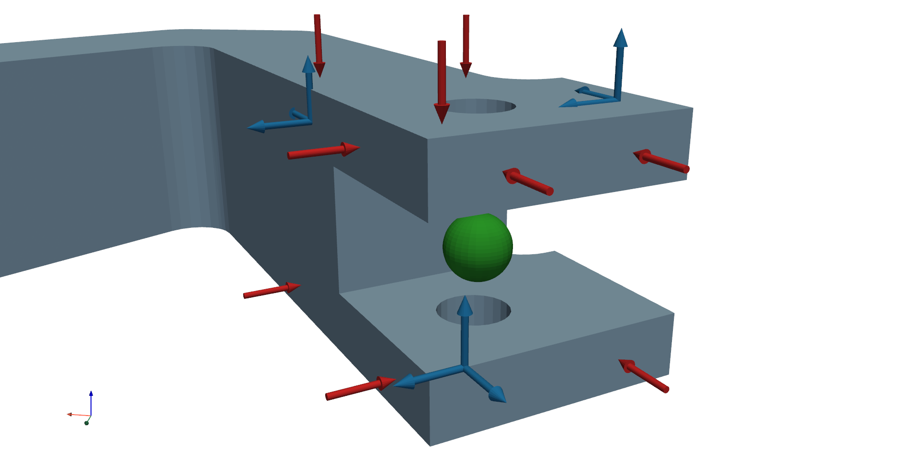

============================
Virtual Point Transformation
============================
Virtual point transformation (VPT) projects measured dynamics on the predefined interface displacement modes (IDMs) [1]_. 
The interface is usualy considered to be rigid; therefore, only 6 rigid interface displacement modes are used in the transformation. Rigid IDMs can also be extended with flexible interface modes.
Current implementation of the :class:`pyFBS.VPT` enables only rigid IDMs in the transformation. But it additionaly supports the expansion where directly measured rotational response is included in the transformation [2]_. 

.. note:: 
   Download example showing the basic use of the VPT: :download:`04_VPT.ipynb <../../examples/04_VPT.ipynb>`
   
Consider an example for the VPT where 9 impacts and 9 channels (3 tri-axial accelerometers) are positioned around the interface:
   

   
****************************
Interface displacement modes
****************************

For the VPT, positional data is required for channels (``df_chn_up``), impacts (``df_imp_up``) and for virtual points  (``df_vp`` and ``df_vpref``). 
After the positions are defined a class instance of :class:`pyFBS.VPT` can be created.

.. code-block:: python

	vpt = pyFBS.VPT(df_chn_up,df_imp_up,df_vp,df_vpref)

Interface displacement reduction :func:`pyFBS.VPT.define_IDM_U` and interface force reduction :func:`pyFBS.VPT.define_IDM_F` are directly defined. Both reduction matrices are avialable as class variables ``vpt.Tu`` and ``vpt.Tf``.

**********************
Application of the VPT
**********************
After the reduction matrices are defined the VPT can be applied directly on an FRF matrix.

.. code-block:: python

		vpt.apply_VPT(freq,FRF)

Transformed FRF matrix is then available as a class variable ``vpt.vptData``.

******************************
Measurement quality indicators
******************************

One of the primary advantages of the VPT is also the ability to evaluate consistency of the performed measurements. 
Measurement consistency is evaluated by expanding the reduced virtual DoFs back to the original DoFs and comparing them with the measured ones.

.. code-block:: python

		vpt.consistency([1],[1])
		
If the interface would be perfectly rigid, the filtered response would be equal to the measured one. 
However, if the interface is not completely rigid or if predetermined positions and orientations are not perfect, the filtered response will vary from the measured response.

Both channel/sensor (``vpt.specific_sensor`` and ``vpt.overall_sensor``) and impact (``vpt.specific_impact`` and ``vpt.overall_impact``) consistency can be evaluated after the transformation. 

.. rubric:: References

.. [1] D. de Klerk, D. J. Rixen, S. N. Voormeeren, and F. Pasteuning. Solving the RDoF Problem in Experimental Dynamic Substructuring. in: Proceedings of the 26th International Modal Analysis Conference, A Conference on Structural Dynamics, (2010), pages, 2008.
.. [2] Tomaž Bregar, Nikola Holeček, Gregor Čepon, Daniel J. Rixen, and Miha Boltežar. Including directly measured rotations in the virtual point transformation. Mechanical Systems and Signal Processing, 141:106440, July 2020.

