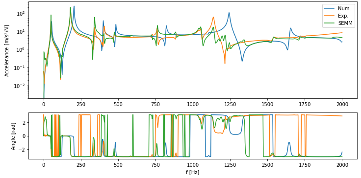

System Equivalent Model Mixing
==============================

System Equivalent Model Mixing (SEMM) [1]_ enables mixing of two equivalent frequency-based models into a hybrid model. 
The models used can either be of numerical or experimental nature. 
One of the models provides the dynamic properties (overlay model) and the second model provides a set of degrees of freedom (parent model). 
A numerical model is commonly used as a parent model and an experimental model is used as an overlay model.

.. note:: 
   Download example showing the basic use of SEMM: :download:`05_SEMM.ipynb <../../examples/05_SEMM.ipynb>`

Example data import
*******************

First import numerical and experimental data (response models). Datasets used in this example are from a laboratory testbench and are available directly within the :mod:`pyFBS`.

Experimental model
------------------
The experimental model must be properly aranged so that the FRFs are of correct shape. 
The first dimension represents the frequency depth, second the response points, and the third excitation points. The experimental model is used as the overlay model.

.. code-block:: python

   exp_file = r"./lab_testbench/Measurements/Y_AB.p"

   freq, Y_exp = np.load(exp_file, allow_pickle = True)
   Y_exp = np.transpose(Y_exp, (2, 0, 1))

Numerical model
---------------
FRFs used for the parent model numerical model can be imported, or generated from the mass and stiffness matrix.
Locations and directions for which FRFs are generated are defined in an Excel file and can be parsed into a :mod:`pandas.DataFrame`.

.. code-block:: python

   stl = r"./lab_testbench/STL/AB.stl"
   xlsx = r"./lab_testbench/Measurements/AM_measurements.xlsx"

   full_file = r"./lab_testbench/FEM/AB.full"
   rst_file = r"./lab_testbench/FEM/AB.rst"]

   MK = pyFBS.MK_model(rst_file, full_file, no_modes = 100, recalculate = False)

   df_chn = pd.read_excel(xlsx, sheet_name='Channels_AB')
   df_imp = pd.read_excel(xlsx, sheet_name='Impacts_AB')

   MK.FRF_synth(df_chn,df_imp, 
                f_start=0,
                f_end=2002.5,
                f_resolution=2.5,
                modal_damping = 0.003,
                frf_type = "accelerance")

The numerical model must also be properly aranged. The first dimension represents the frequency depth, second the response points, and the third excitation points. 
Additionaly, the frequency resolution of the numerical and experimental model has to be the same.

The numerical model is not necessarily a square matrix, as it can also be rectangular. But the numerical model should contain all the DoFs from the experimental model.

Application of SEMM
*******************

The function enables the implementation of three SEMM method formulations: ``basic``, ``fully-extend`` and ``fully-extend-svd``, the choice of which is defined with the ``SEMM_type`` parameter.
The ``red_comp`` and ``red_eq`` parameters can be used to influence the number of eigenvalues used to ensure equilibrium and compatibility conditions when the ``fully-extend-svd`` formulation is used [2]_.

The result is a hybrid model that contains the DoFs represented in the numerical model.

In the example below, only a part of the experimental response matrix is included in SEMM. The remaining DoFs are used to evaluate SEMM.
It is essential that the order of measurements in the experimental model ``Y_exp`` coincides with the order of measurements in the parameters ``df_chn_exp`` and ``df_imp_exp``.

.. code-block:: python

   Y_AB_SEMM = pyFBS.SEMM(MK.FRF, Y_exp[:, 0:15, 5:20],
                          df_chn_num = df_chn, 
                          df_imp_num = df_imp, 
                          df_chn_exp = df_chn[0:15], 
                          df_imp_exp = df_imp[5:20], 
                          SEMM_type='fully-extend-svd', red_comp=10, red_eq=10)

Finnaly, the results of the hybrid model can be compared with the reference and the numerical model.

.. code-block:: python

   s1 = 24
   s2 = 24

   display(df_chn.iloc[[s1]])
   display(df_imp.iloc[[s2]])

   plt.figure(figsize = (12,8))

   plt.subplot(211)
   plt.semilogy(MK.freq,np.abs(MK.FRF[:,s1,s2]), label = "Num.")
   plt.semilogy(freq,np.abs(Y_exp[:, s1,s2]), label = "Exp.")
   plt.semilogy(freq,np.abs(Y_AB_SEMM[:, s1,s2]), label = "SEMM")
   plt.ylabel("Accelerance [m/s$^2$/N]")
   plt.legend()

   plt.subplot(413)
   plt.plot(MK.freq,np.angle(MK.FRF[:,s1,s2]))
   plt.plot(freq,np.angle(Y_exp[:, s1,s2]))
   plt.plot(MK.freq,np.angle(Y_AB_SEMM[:,s1,s2]))
   plt.xlabel("f [Hz]")
   plt.ylabel("Angle [rad]")
   

   

.. rubric:: References

.. [1] Steven WB Klaassen, Maarten V. van der Seijs, and Dennis de Klerk. System equivalent model mixing. Mechanical Systems and Signal Processing, 105:90–112, 2018.
.. [2] Steven WB Klaassen and D. J. Rixen. The Inclusion of a Singular-value Based Filter in SEMM. in: Proceedings of the 38th International Modal Analysis Conference, A Conference on Structural Dynamics, (2020), 2020.