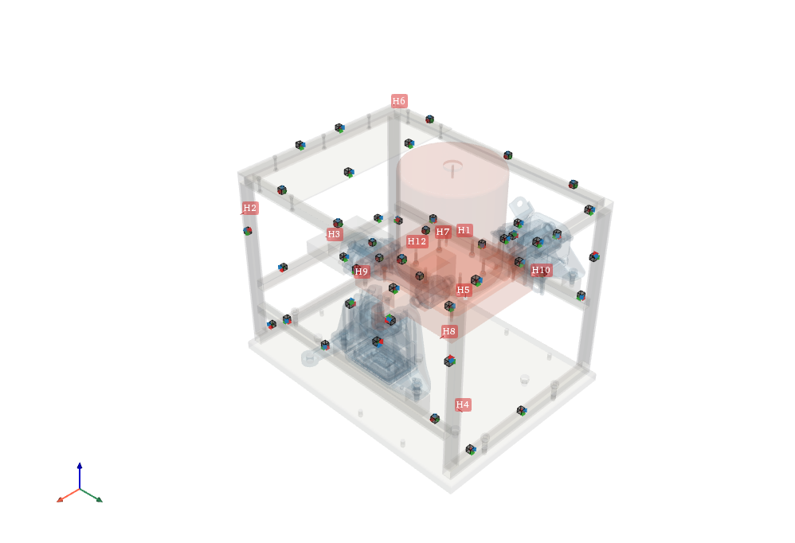
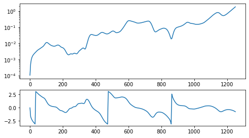
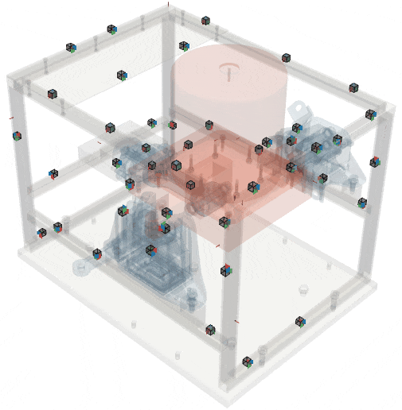

#############################
Operational Deflection Shapes
#############################

The 3D display of the pyFBS can also be used to animate any objects. Animation can either be performed on meshes or on the predefined objects (such as accelerometers). 
In this example an Operational Deflection Shape (ODS) of an automotive testbench is animated.

.. note:: 
   Download example showing an application of the ODS: :download:`06_ODS.ipynb <../../examples/06_operational_deflection_shapes_ODS.ipynb>`

Example Datasets and 3D view
----------------------------

As already shown in the `3D Display <../../html/examples/01_static_display.html>`_ one can load predefined datasets from the available examples and add a structure from STL file to the 3D view. This allows both the sensors and excitation points (impacts) to be visualized.

    

Experimental example
********************
Load the experimental data, which will be used for the operational deflection shape animation

.. code-block:: python

	_file = r"./automotive_testbench/Measurements/ODS.p"
	freq, Y_ODS = np.load(_file,allow_pickle = True)
	
Checkout a single FRF:

.. code-block:: python

	select_out = 5
	select_in = 1

	display(df_chn.iloc[[select_out]])
	display(df_imp.iloc[[select_in]])

	plt.figure(figsize = (8,6))
	plt.subplot(211)
	plt.semilogy(freq,np.abs(Y_ODS[:,select_out,select_in]))

	plt.subplot(413)
	plt.plot(freq,np.angle(Y_ODS[:,select_out,select_in]))

	

	
Accelerometer animation and GIF export
--------------------------------------
The objects placed in the 3D view can be simply animated.
In this example an operational deflection shape at a certain impact position is animated.
The pyFBS supports also an export to a GIF file. 
Before running the animation just set the output directory ``view3D.gif_dir`` and set the variable ``view3D.take_gif = True``. 
When the GIF is exporting the animation can lag within the 3D display. 

.. code-block:: python

	freq_sel = -1
	select_in = 6

	emp_2 = pyFBS.orient_in_global(Y_ODS[freq_sel,:,select_in],df_chn,df_acc)

	mode_dict = pyFBS.dict_animation(emp_2,"object",object_list = view3D.global_acc,r_scale=30)
	mode_dict["freq"] = freq[freq_sel]
	
	view3D.take_gif = True
	view3D.gif_dir = "..\\pyFBS\\output.gif"

	view3D.add_objects_animation(mode_dict,run_animation = True,add_note= True)
	

