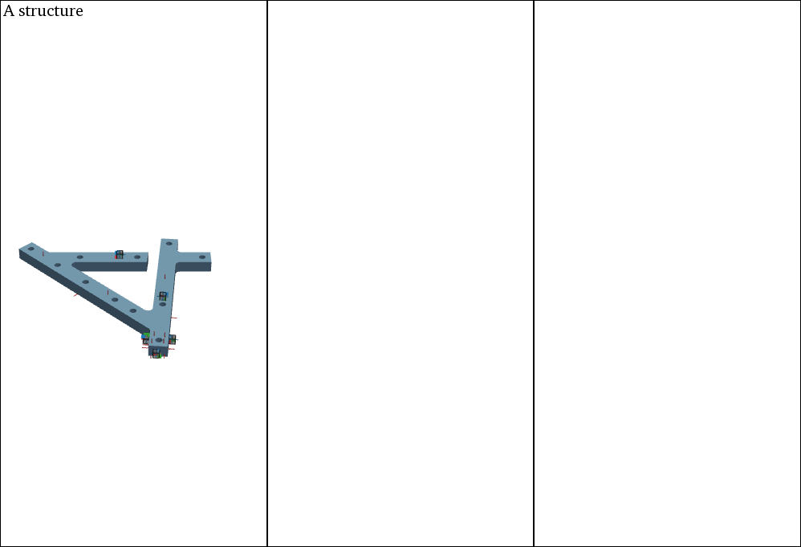
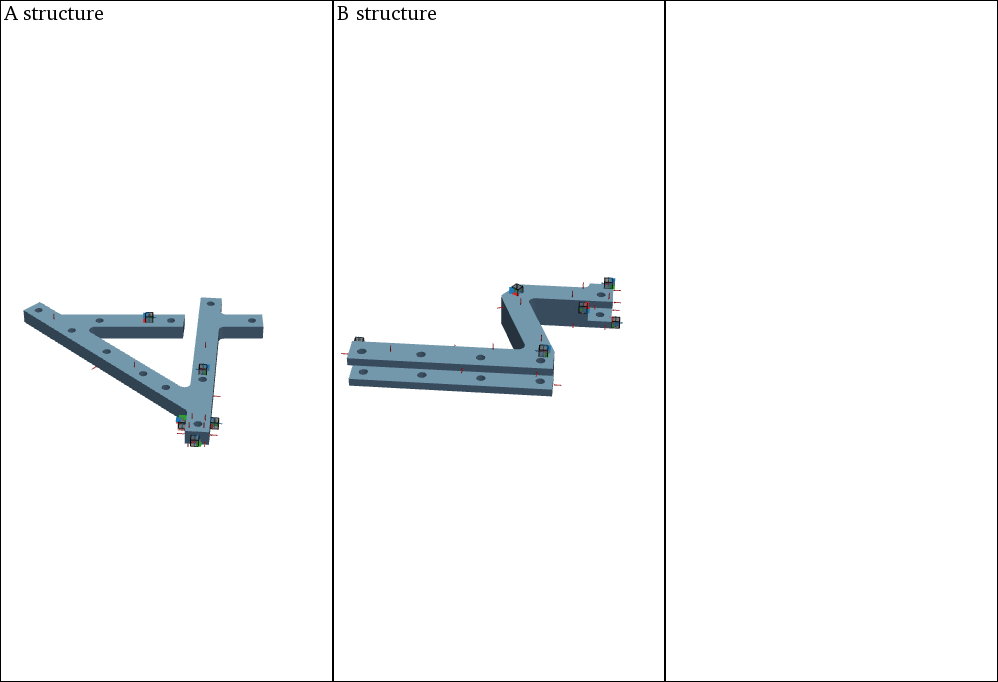
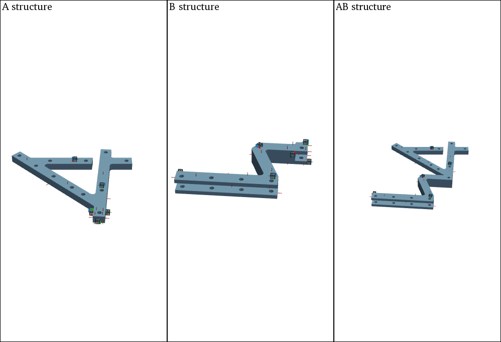
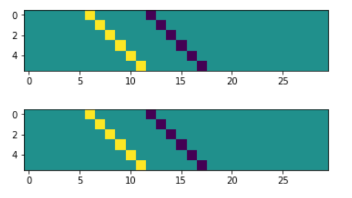
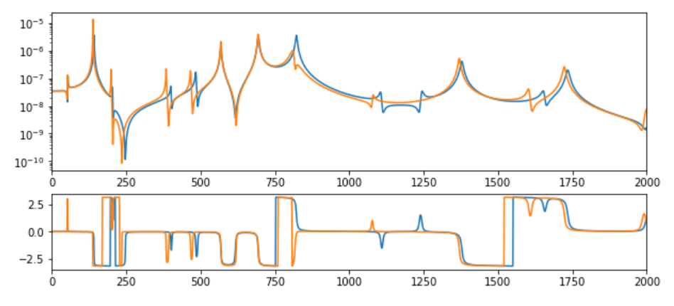

########
Coupling
########

With the pyFBS coupling and also decoupling of different substructers can be performed in relatively simple manner. 
In this example a numerical example is used to demonstrate a basic coupling example with a virtual point transformation at the interface. 
This can also be performed analogously with experimentally acquired data.

.. note:: 
   Download example showing a substructure coupling application: :download:`07_coupling.ipynb <../../examples/07_FBS_coupling.ipynb>`

    
Example Datasets and 3D view
****************************
Load the required predefined datasets and open the 3D viewer in the background as already shown in `3D Display <../../html/examples/01_static_display.html>`_. 
Especially for the illustration of different substructures and the assembly, the 3D viewer subplot capabilities of `PyVista <https://docs.pyvista.org/index.html>`_ can be used.

.. code-block:: python

    view3D = pyFBS.view3D(show_origin = False, show_axes = False,shape =  (1,3),title = "Overview")
    
Add an STL file of substructure A to the 1-1 subplot and show the corresponding accelerometers, channels and impacts.

.. code-block:: python

    view3D.plot.subplot(0,0)
    view3D.plot.isometric_view()
    view3D.plot.add_text("A structure", position='upper_left', font_size=10, color="k", font="times", name="A_structure")

    view3D.add_stl(stl_dir_A,color = "#83afd2",name = "A");
    view3D.show_acc(df_acc_A)
    view3D.show_imp(df_imp_A)
    view3D.show_chn(df_chn_A)
    

    
    
Add an STL file of substructure B to the 1-2 subplot and show the corresponding accelerometers, channels and impacts.

.. code-block:: python

    view3D.plot.subplot(0,1)
    view3D.plot.isometric_view()
    view3D.plot.add_text("B structure", position='upper_left', font_size=10, color="k", font="times", name="B_structure")

    view3D.add_stl(stl_dir_B,color = "#83afd2",name = "B");
    view3D.show_acc(df_acc_B,overwrite = False)
    view3D.show_imp(df_imp_B,overwrite = False)
    view3D.show_chn(df_chn_B,overwrite = False)
 

   
    
Add an STL file of the assembly AB to the 1-2 subplot and show the corresponding reference accelerometers, channels and impacts.
 
.. code-block:: python

    view3D.plot.subplot(0,2)
    view3D.plot.isometric_view()
    view3D.plot.add_text("AB structure", position='upper_left', font_size=10, color="k", font="times", name="AB_structure");

    view3D.add_stl(stl_dir_AB,color = "#83afd2",name = "AB");
    view3D.show_acc(df_acc_AB,overwrite = False)
    view3D.show_imp(df_imp_AB,overwrite = False)
    view3D.show_chn(df_chn_AB,overwrite = False)
    

        
Each separate subplot view can also be linked or unlinked:

.. code-block:: python

    view3D.plot.link_views()
    #view3D.plot.unlink_views()
    

Numerical model
***************
Load the corresponding .full and .ress file from the example datasets. For more information on .full and .ress files refer to the :download:`03_FRF_synthetization.ipynb <../../examples/03_FRF_synthetization.ipynb>` example.

.. code-block:: python

	full_file_AB = r"./lab_testbench/FEM/AB.full"
	ress_file_AB = r"./lab_testbench/FEM/AB.rst"

	full_file_B = r"./lab_testbench/FEM/B.full"
	ress_file_B = r"./lab_testbench/FEM/B.rst"

	full_file_A = r"./lab_testbench/FEM/A.full"
	ress_file_A = r"./lab_testbench/FEM/A.rst"
    
Create an MK model for each component:

.. code-block:: python

    MK_A = pyFBS.MK_model(ress_file_A,full_file_A,no_modes = 100,allow_pickle= True,recalculate = False)
    MK_B = pyFBS.MK_model(ress_file_B,full_file_B,no_modes = 100,allow_pickle= True,recalculate = False)
    MK_AB = pyFBS.MK_model(ress_file_AB,full_file_AB,no_modes = 100,allow_pickle= True,recalculate = False)
    
Update locations of channels and impacts to snap to the nearest FE node.

.. code-block:: python

    df_chn_A_up = MK_A.update_locations_df(df_chn_A)
    df_imp_A_up = MK_A.update_locations_df(df_imp_A)

    df_chn_B_up = MK_B.update_locations_df(df_chn_B)
    df_imp_B_up = MK_B.update_locations_df(df_imp_B)

    df_chn_AB_up = MK_AB.update_locations_df(df_chn_AB)
    df_imp_AB_up = MK_AB.update_locations_df(df_imp_AB)
    
Perform the FRF sythetization for each component based on the updated locations.

.. code-block:: python

    MK_A.FRF_synth(df_chn_A_up,df_imp_A_up,f_start = 0,modal_damping = 0.003)
    MK_B.FRF_synth(df_chn_B_up,df_imp_B_up,f_start = 0,modal_damping = 0.003)
    MK_AB.FRF_synth(df_chn_AB_up,df_imp_AB_up,f_start = 0,modal_damping = 0.003)
    
    
Virtual point transformation
****************************
The VPT can be performed directly on the generated data. See the :download:`04_VPT.ipynb <../../examples/04_VPT.ipynb>` example for more options and details.

.. code-block:: python

    df_vp = pd.read_excel(pos_xlsx, sheet_name='VP_Channels')
    df_vpref = pd.read_excel(pos_xlsx, sheet_name='VP_RefChannels')

    vpt_A = pyFBS.VPT(df_chn_A_up,df_imp_A_up,df_vp,df_vpref)
    vpt_B = pyFBS.VPT(df_chn_B_up,df_imp_B_up,df_vp,df_vpref)
    
Apply the defined VP transformation on the FRFs:

.. code-block:: python

    vpt_A.apply_VPT(MK_A.freq,MK_A.FRF)
    vpt_B.apply_VPT(MK_B.freq,MK_B.FRF)
    
Extract the requried FRFs and the frequency vector:

.. code-block:: python

    freq = MK_A.freq
    Y_A = vpt_A.vptData
    Y_B = vpt_B.vptData
    
LM-FBS Coupling
***************
First the compatibility and the equiliubrium condition has to be defined through the signed Boolean matrices. For this example the 6 VP DoFs at the interface are coupled.

.. code-block:: python

    Y_AnB = np.zeros((2000,12+18,12+18),dtype = complex)

    Y_AnB[:,0:12,0:12] = Y_A
    Y_AnB[:,12:,12:] =   Y_B

    k = 6
    Bu = np.zeros((k,12+18))
    Bu[:k,6:6+k] = 1*np.eye(k)
    Bu[:k,12:12+k] = -1*np.eye(k)

    plt.figure()
    plt.imshow(Bu)

    Bf = np.zeros((k,12+18))
    Bf[:k,6:6+k] = 1*np.eye(k)
    Bf[:k,12:12+k] = -1*np.eye(k)

    plt.figure()
    plt.imshow(Bf)

    
    
Apply the LM-FBS based on the defined coompatibility and equilibrium conditions.

.. code-block:: python

    Y_ABn = np.zeros_like(Y_AnB,dtype = complex)

    Y_int = Bu@Y_AnB@Bf.T
    Y_ABn = Y_AnB - Y_AnB@Bf.T@np.linalg.pinv(Y_int)@Bu@Y_AnB
    
Final results
*************

First extract the FRFs at the reference DoFs:

.. code-block:: python

    arr_coup = [0,1,2,3,4,5,18,19,20,21,22,23,24,25,26,27,28,29]
    Y_AB_coupled = Y_ABn[:,arr_coup,:][:,:,arr_coup]
    Y_AB_ref = MK_AB.FRF
    
The coupled and the reference results can then be compared and evaluated:
    

    