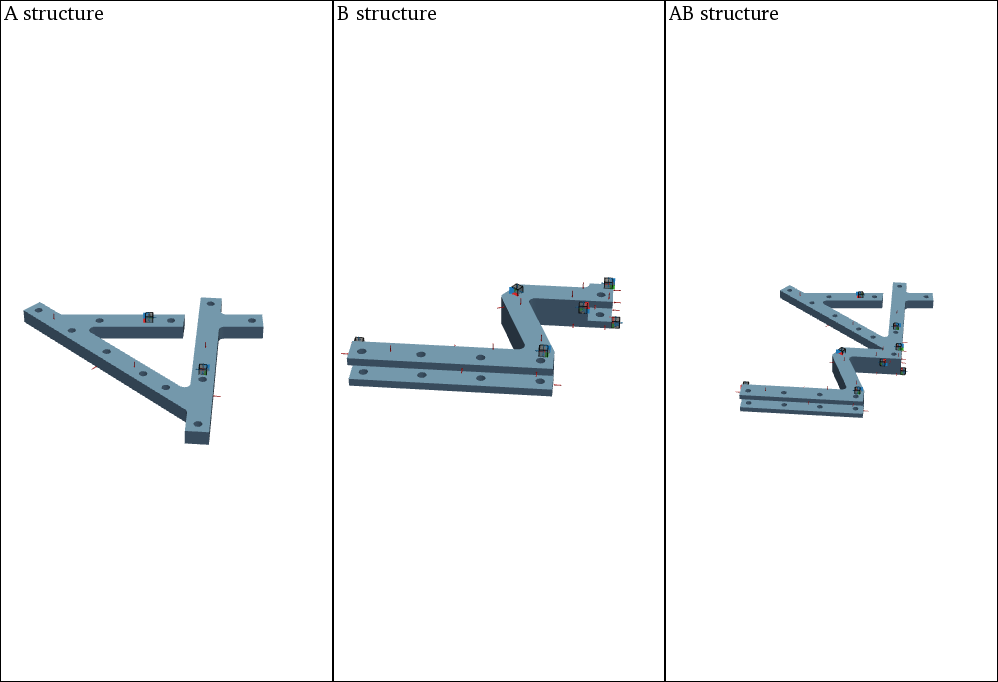
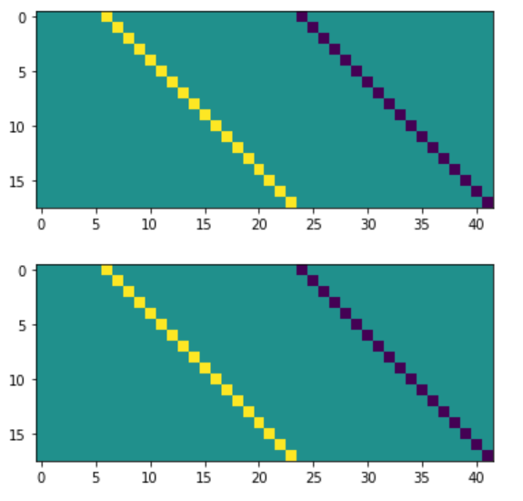
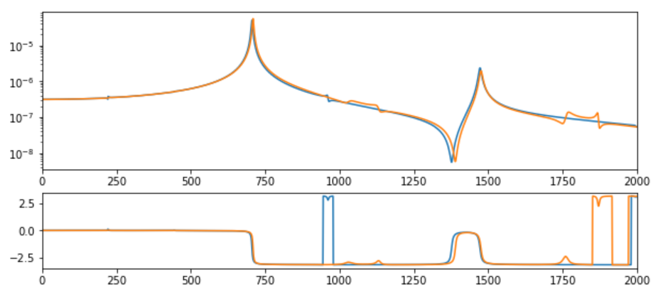

##########
Decoupling
##########

With the pyFBS also decoupling of different substructers can be performed in relatively simple manner. In this example a numerical example is used to demonstrate a basic coupling example with a virtual point transformation at the interface.

.. note:: 
   Download example showing a substructure decoupling application: :download:`08_decoupling.ipynb <../../examples/08_FBS_decoupling.ipynb>`
    
Example Datasets and 3D view
****************************

Load the required predefined datasets and open the 3D viewer in the background as already shown in `3D Display <../../html/examples/01_static_display.html>`_. Also for decoupling, a subplot representation, as already presented in `Coupling <../../html/examples/07_coupling.html>`_, can be used.
    

   
    
Numerical model
***************
Load the corresponding .full and .ress file from the example datasets. For more information on .full and .ress files refer to the :download:`03_FRF_synthetization.ipynb <../../examples/03_FRF_synthetization.ipynb>` example

.. code-block:: python

	full_file_AB = r"./lab_testbench/FEM/AB.full"
	ress_file_AB = r"./lab_testbench/FEM/AB.rst"

	full_file_B = r"./lab_testbench/FEM/B.full"
	ress_file_B = r"./lab_testbench/FEM/B.rst"

	full_file_A = r"./lab_testbench/FEM/A.full"
	ress_file_A = r"./lab_testbench/FEM/A.rst"
    
Create an MK model for each component:

.. code-block:: python

    MK_A = pyFBS.MK_model(ress_file_A,full_file_A,no_modes = 100,allow_pickle= True,recalculate = False)
    MK_B = pyFBS.MK_model(ress_file_B,full_file_B,no_modes = 100,allow_pickle= True,recalculate = False)
    MK_AB = pyFBS.MK_model(ress_file_AB,full_file_AB,no_modes = 100,allow_pickle= True,recalculate = False)
    
Update locations of channels and impacts to snap to the nearest FE node.

.. code-block:: python

    df_chn_A_up = MK_A.update_locations_df(df_chn_A)
    df_imp_A_up = MK_A.update_locations_df(df_imp_A)

    df_chn_B_up = MK_B.update_locations_df(df_chn_B)
    df_imp_B_up = MK_B.update_locations_df(df_imp_B)

    df_chn_AB_up = MK_AB.update_locations_df(df_chn_AB)
    df_imp_AB_up = MK_AB.update_locations_df(df_imp_AB)
    
Perform the FRF sythetization for each component based on the updated locations.

.. code-block:: python

    MK_A.FRF_synth(df_chn_A_up,df_imp_A_up,f_start = 0,modal_damping = 0.003)
    MK_B.FRF_synth(df_chn_B_up,df_imp_B_up,f_start = 0,modal_damping = 0.003)
    MK_AB.FRF_synth(df_chn_AB_up,df_imp_AB_up,f_start = 0,modal_damping = 0.003)
    
Virtual point transformation
****************************
The VPT can be performed directly on the generated data. See the 04_VPT.ipynb example for more options and details.

.. code-block:: python

    df_vp = pd.read_excel(pos_xlsx, sheet_name='VP_Channels')
    df_vpref = pd.read_excel(pos_xlsx, sheet_name='VP_RefChannels')

    vpt_AB = pyFBS.VPT(df_chn_AB_up,df_imp_AB_up,df_vp,df_vpref)
    vpt_B = pyFBS.VPT(df_chn_B_up,df_imp_B_up,df_vp,df_vpref)
    
Apply the defined VP transformation on the FRFs:

.. code-block:: python

    vpt_AB.apply_VPT(MK_AB.freq,MK_AB.FRF)
    vpt_B.apply_VPT(MK_B.freq,MK_B.FRF)
    
Extract the requried FRFs and the frequency vector:

.. code-block:: python

    freq = MK_AB.freq
    Y_AB = vpt_AB.vptData
    Y_B = vpt_B.vptData
    
LM-FBS Decoupling
*****************
First the compatibility and the equiliubrium condition has to be defined through the signed Boolean matrices. For this example the 6 VP DoFs at the interface are coupled.

.. code-block:: python

    Y_ABnB = np.zeros((2000,24+18,24+18),dtype = complex)

    Y_ABnB[:,0:24,0:24] = Y_AB
    Y_ABnB[:,24:,24:] =   -1*Y_B

    k = 6 + 12 # Extended compatibility and equilibrium to internal dofs
    Bu = np.zeros((k,24+18))
    Bu[:k,6:6+k] = 1*np.eye(k)
    Bu[:k,24:24+k] = -1*np.eye(k)

    plt.figure()
    plt.imshow(Bu)

    Bf = np.zeros((k,24+18))
    Bf[:k,6:6+k] = 1*np.eye(k)
    Bf[:k,24:24+k] = -1*np.eye(k)

    plt.figure()
    plt.imshow(Bf)
    

    
Apply the LM-FBS based on the defined coompatibility and equilibrium conditions.

.. code-block:: python

    Y_An = np.zeros_like(Y_ABnB,dtype = complex)

    Y_int = Bu@Y_ABnB@Bf.T
    Y_An =Y_ABnB - Y_ABnB@Bf.T@np.linalg.pinv(Y_int)@Bu@Y_ABnB
    
Final results
*************
First extract the FRFs at the reference DoFs:

.. code-block:: python

    arr_coup = [0,1,2,3,4,5]
    Y_A_coupled = Y_An[:,arr_coup,:][:,:,arr_coup]
    Y_A_ref = MK_A.FRF
    
The decoupled and the reference results can then be compared and evaluated:
   

   

