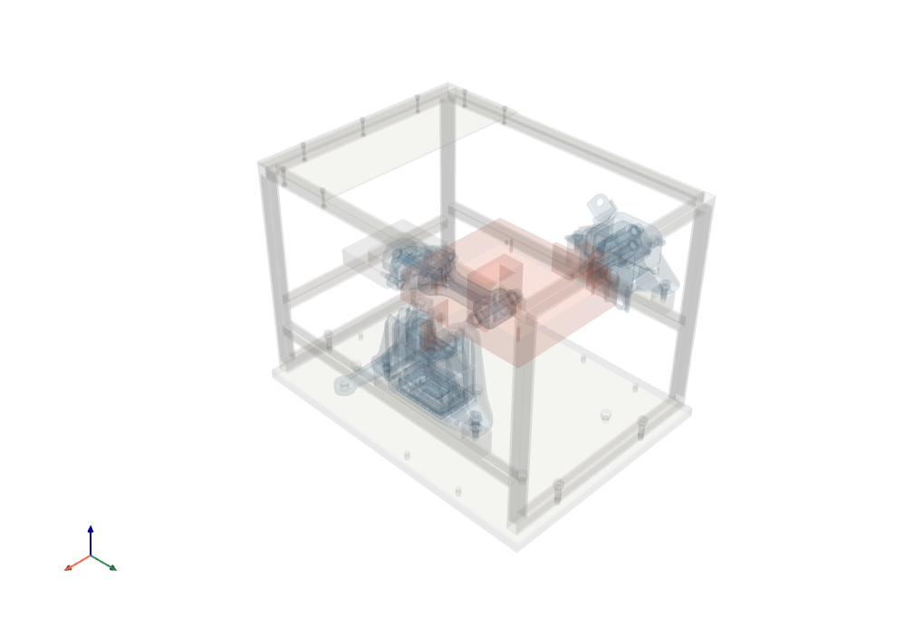
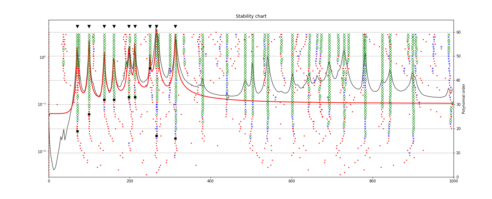
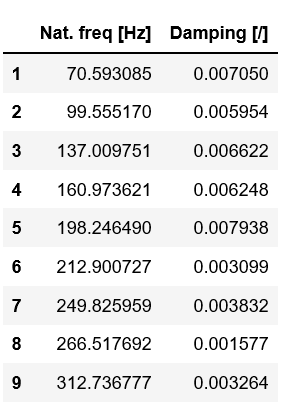
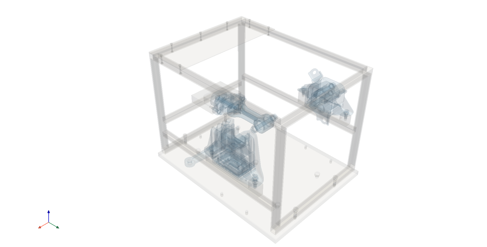
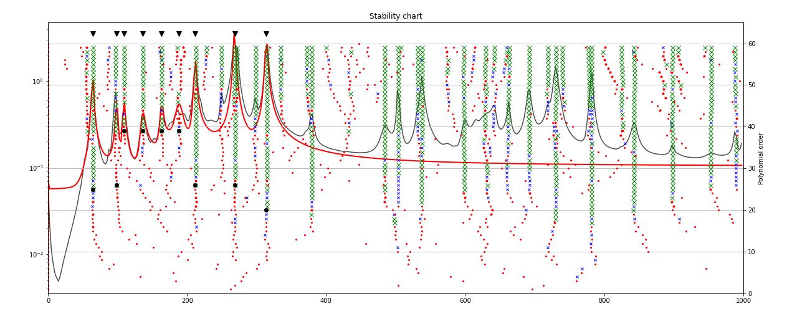
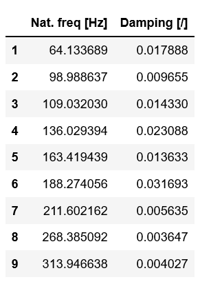
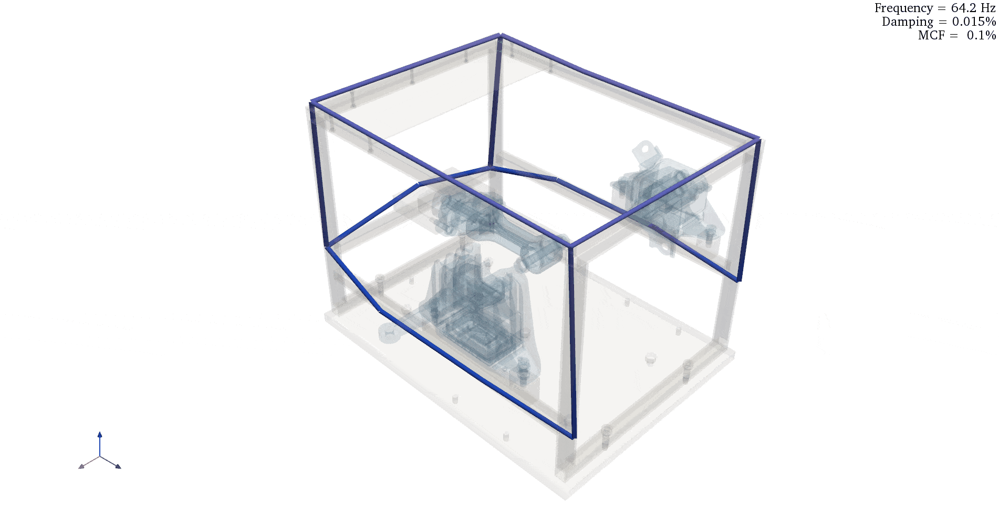

#################################
Experimental modal analysis (EMA)
#################################

The pyFBS can be also used with other Python packages for structural dynamics. 
One of those packages is `pyEMA <https://pypi.org/project/pyEMA/>`_ which can be used to perform an Experimental Modal Analysis (EMA). 
In this example an integration of the two packages is shown on a frame of the automotive testbench example. 
Real experimental data is used in this example and it is also available directly within the pyFBS.

.. note:: 
   Download example showing an Experimental Modal Analysis (EMA) application: :download:`09_EMA.ipynb <../../examples/09_experimental_modal_analysis_EMA.ipynb>`

Example Datasests and 3D display
********************************

Load the required predefined datasets. Open a 3Dviewer in the background. Add the STL file of the assembly to the 3D display:

   
Experimental Modal analysis - Assembly
======================================
Experimental modal analysis in Python can be performed with pyEMA package. Currently single reference modal identification with LSCD/LSFD is supported. For more details check the pyEMA documentation.

pyEMA
*****

Perform the LSCF/LSFD experimental identification of modal parameters:

.. code-block:: python

    Y =  Y_m1[:,:,0].T

    modal_1 = pyEMA.Model(Y,freq,pol_order_high=60,lower = 0,upper = 1000)
    modal_1.get_poles()
    modal_1.select_poles()

    H_acc, modes_1 = modal_1.get_constants(whose_poles=modal_1,least_squares_type="old")
    pd.DataFrame({"Nat. freq [Hz]": modal_1.nat_freq,"Damping [/]": modal_1.nat_xi},index = np.arange(len(modal_1.nat_freq))+1)

   
   

   
For the animation a mesh can be manually created. In this example line connections between the points are made. For more details on :mod:`pv.PolyData` check an example from `PyVista <https://docs.pyvista.org/index.html>`_.

.. code-block:: python

	pos_array = df_acc[["Position_1","Position_2","Position_3"]].to_numpy()*1000
	faces = np.hstack([[2,1,2],[2,3,2],[2,3,13],[2,0,13],[2,0,1],[2,0,1],[2,5,1],[2,5,12],[2,4,12],[2,9,4],
	                   [2,9,8],[2,8,7],[2,0,4],[2,5,11],[2,10,11],[2,10,6],[2,2,6],[2,3,7]]).astype(np.int8)
	point_cloud_1 = pv.PolyData(pos_array,faces)
	pts_1 = point_cloud_1.points.copy()

	view3D_1.plot.add_mesh(point_cloud_1,name = "mesh",render_lines_as_tubes = True, line_width=10, color = "k",clim = [-1,1], cmap="coolwarm",scalars = np.zeros(pts_1.shape[0]),style = "wireframe");
    
Mode shape animation
********************
The identified mode shape can be animated directly in the 3D view:

.. code-block:: python

    mode_select_1 = 0

    emp_1 = pyFBS.orient_in_global(modes_1[:,mode_select_1],df_chn,df_acc)
    mode_dict = pyFBS.dict_animation(emp_1,"modeshape",pts = pts_1,mesh = point_cloud_1,r_scale = 50)

    mode_dict["freq"] = modal_1.nat_freq[mode_select_1]
    mode_dict["damp"] = modal_1.nat_xi[mode_select_1]
    mode_dict["mcf"] = pyFBS.MCF(modes_1[:,mode_select_1])

    view3D_1.add_modeshape(mode_dict,run_animation = True,add_note = True)

.. figure:: ./data/modal_1_min.gif
   :width: 800px
   
EMA - Assembly without the source
=================================

3D View
*******
You can open multiple displays at once and performs simoultenous analyses. Open a second 3D display:

.. code-block:: python

    view3D_2 = pyFBS.view3D()
    
Add the STL files of the assembly without the source structure to the 3D view:

.. code-block:: python

    view3D_2.add_stl(stl_rec,name = "receiver_0",color = "#e0e0e0",opacity = .1)
    view3D_2.add_stl(stl_tm,name = "transmission_mount_0",color = "#83afd2",opacity = .1)
    view3D_2.add_stl(stl_rm,name = "roll_mount_0",color = "#83afd2",opacity = .1)
    view3D_2.add_stl(stl_em,name = "engine_mount_0",color = "#83afd2",opacity = .1);
 

pyEMA
*****
Perform the LSCF/LSFD experimental identification of modal parameters:

.. code-block:: python

    # select the reference DoF
    Y =  Y_m2[:,:,0].T

    modal_2 = pyEMA.Model(Y,freq,pol_order_high=60,lower = 0,upper = 1000)
    modal_2.get_poles()
    modal_2.select_poles()
    H_acc, modes_2 = modal_2.get_constants(whose_poles=modal_2,least_squares_type="old")
    pd.DataFrame({"Nat. freq [Hz]": modal_2.nat_freq,"Damping [/]": modal_2.nat_xi},index = np.arange(len(modal_2.nat_freq))+1)

   

   
Create a mesh and add it to the 3D view:
****************************************

.. code-block:: python

    pos_array = df_acc[["Position_1","Position_2","Position_3"]].to_numpy()*1000
    
    point_cloud_2 = pv.PolyData(pos_array,faces)
    pts_2 = point_cloud_2.points.copy()
    view3D_2.plot.add_mesh(point_cloud_2,name = "mesh",render_lines_as_tubes = True, line_width=10, color = "k",clim = [-1,1], cmap="coolwarm",scalars = np.zeros(pts_2.shape[0]),style = "wireframe")
    
Mode shape animation
********************
The second set of identified mode shapes can be animated directly in the 3D view. As two instances of the pyFBS.view3D can be created in the same analysis a side-by-side comparison is possible:

.. code-block:: python

    mode_select_2 = 0

    emp_2 = pyFBS.orient_in_global(modes_2[:,mode_select_2],df_chn,df_acc)
    mode_dict = pyFBS.dict_animation(emp_2,"modeshape",pts = pts_2,mesh = point_cloud_2,r_scale = 50)

    mode_dict["freq"] = modal_2.nat_freq[mode_select_2]
    mode_dict["damp"] = modal_2.nat_xi[mode_select_2]
    mode_dict["mcf"] = pyFBS.MCF(modes_2[:,mode_select_2])

    view3D_2.add_modeshape(mode_dict,run_animation = True,add_note = True)
    
