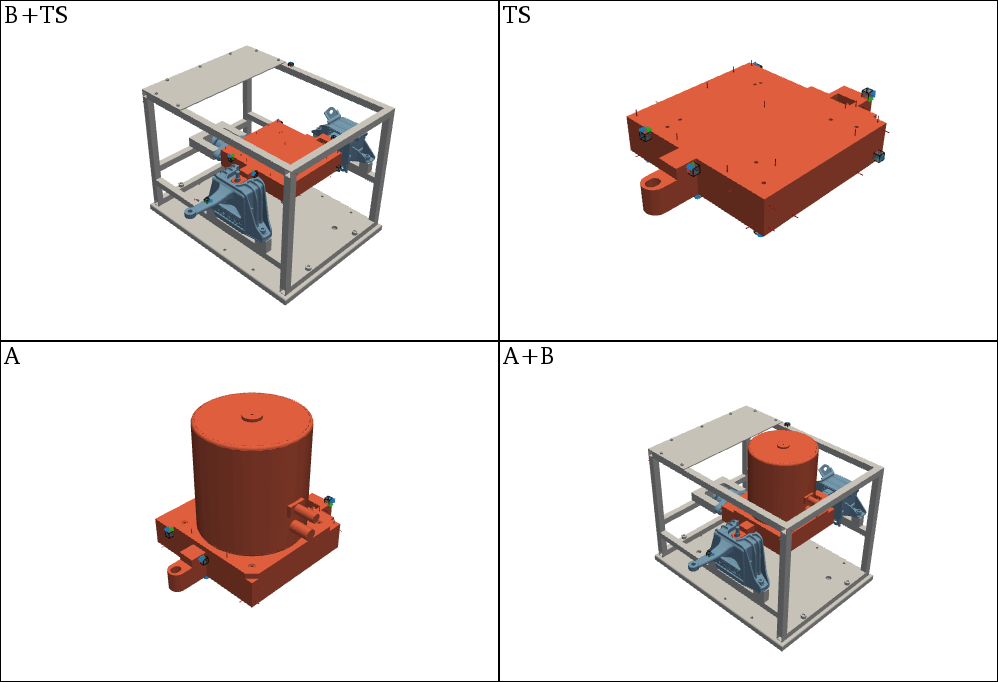
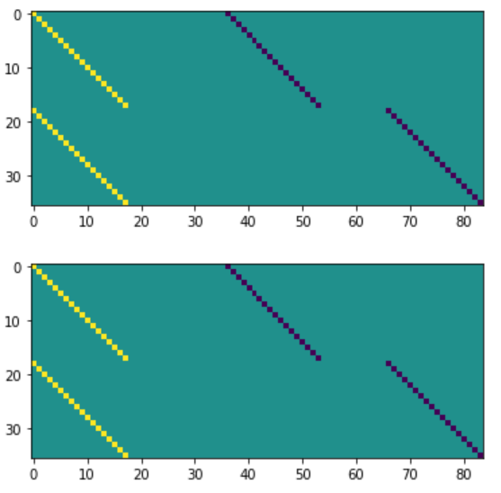
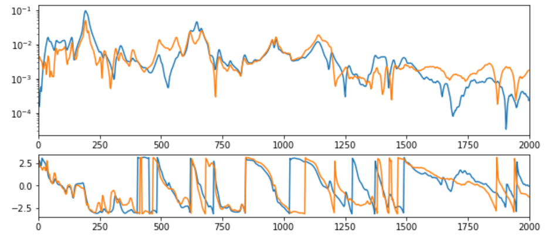

#############################
Transmission simulator in FBS
#############################

The method of Transmission Simulator (TS) is primarly used direclty in the modal domain. Nevertheless, the concept of attaching a transmission simulator at the interface can be used also in the frequency domain. In this example a frequency based subtructuring is performed on a complex structure. First a transmission simulator is decoupled from the receiver structure and aftewards a source structure is coupled to the receiver structure. At the interface the VPT is used to obtain collocated interface DoFs.

.. note:: 
   Download example showing a Transmission Simulator (TS) application: :download:`10_TS.ipynb <../../examples/10_FBS_transmission_simulator.ipynb>`.

Example Datasests and 3D view
*****************************
As already shown in the `3D Display <../../html/examples/01_static_display.html>`_ one can load the predefined datasets from an example and add a structure from STL file to the 3D display. This allows both the acceleration sensors and excitation points to be visualized. Also for the transmission simulator application, a subplot representation, as already presented in `Coupling <../../html/examples/07_coupling.html>`_, can be used.
	

   
Virtual point transformation
****************************
The VPT can be performed on experimental data. See the :download:`04_VPT.ipynb <../../examples/04_VPT.ipynb>` example for more options and details.

.. code-block:: python

	df_vp = pd.read_excel(xlsx_A, sheet_name='VP Channels')
	df_vpref = pd.read_excel(xlsx_A, sheet_name='VP RefChannels')

	vpt_TS = pyFBS.VPT(df_chn_TS,df_imp_TS,df_vp,df_vpref,sort_matrix = False)
	vpt_BTS = pyFBS.VPT(df_chn_BTS,df_imp_BTS,df_vp,df_vpref,sort_matrix = False)
	vpt_A = pyFBS.VPT(df_chn_A,df_imp_A,df_vp,df_vpref,sort_matrix = False)

	vpt_TS.apply_VPT(freq,Y_TS)
	vpt_BTS.apply_VPT(freq,Y_BTS)
	vpt_A.apply_VPT(freq,Y_A)

	Y_TS_tran = vpt_TS.vptData
	Y_BTS_tran = vpt_BTS.vptData
	Y_A_tran = vpt_A.vptData
	
LM-FBS coupling and decoupling
==============================
First the compatibility and the equiliubrium condition has to be defined through the signed Boolean matrices. For this example the 6 VP DoFs at the interface are coupled.

.. code-block:: python

	Y_AnB = np.zeros((800,30+36+18,30+36+18),dtype = complex)

	Y_AnB[:,0:36,0:36] = Y_BTS_tran
	Y_AnB[:,36:36+30,36:36+30] = -1*Y_TS_tran
	Y_AnB[:,30+36:,30+36:] = Y_A_tran

	k = 18
	Bu = np.zeros((2*k,36+30+18))
	Bu[:k,0:k] = 1*np.eye(k)
	Bu[:k,36:36+k] = -1*np.eye(k)

	Bu[k:,0:k] = 1*np.eye(k)
	Bu[k:,36+30:36+30+k] = -1*np.eye(k)

	Bf = np.zeros((2*k,36+30+18))
	Bf[:k,0:k] = 1*np.eye(k)
	Bf[:k,36:36+k] = -1*np.eye(k)

	Bf[k:,0:k] = 1*np.eye(k)
	Bf[k:,36+30:36+30+k] = -1*np.eye(k)

	plt.figure()
	plt.imshow(Bu)
	plt.figure()
	plt.imshow(Bf);
	

   
Apply the LM-FBS based on the defined coompatibility and equilibrium conditions.

.. code-block:: python

	Y_ABn = np.zeros_like(Y_AnB,dtype = complex)

	Y_int = Bu@Y_AnB@Bf.T
	Y_ABn = Y_AnB - Y_AnB@Bf.T@np.linalg.pinv(pyFBS.TSVD(Y_int,reduction = 22))@Bu@Y_AnB
	
First extract the FRFs at the reference DoFs:

.. code-block:: python

	arr_out = [30,31,32,33,34,35]
	arr_in = [30,31,32,33,34,35]

	Y_AB_coupled = Y_ABn[:,arr_out,:][:,:,arr_in]
	Y_AB_ref = Y_AB_ref[:,:,:]
	
Finnaly, the coupled and the reference results can be compared and evaluated:

