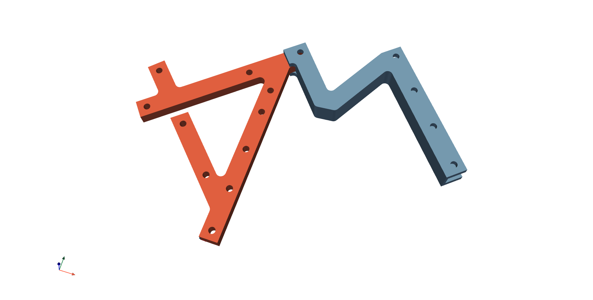
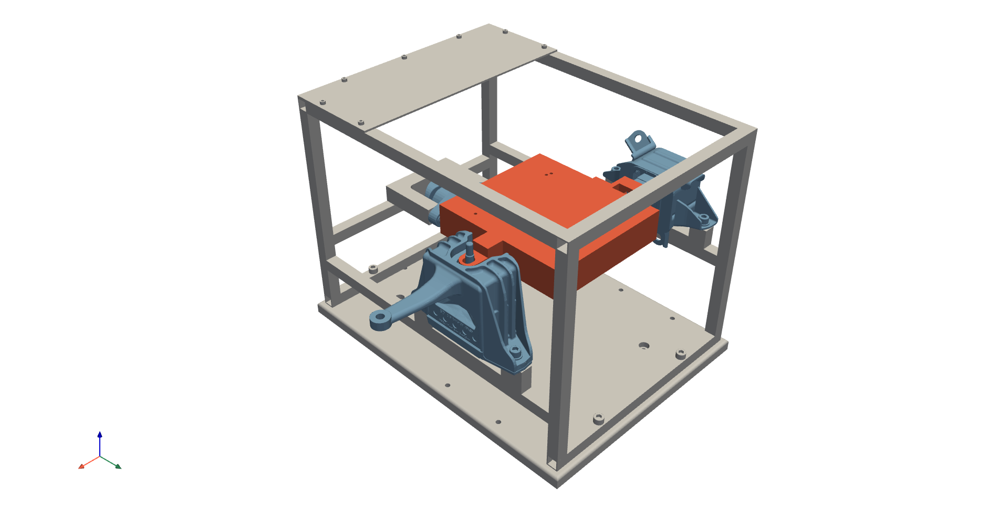

=====
Usage
=====

To use :mod:`pyFBS` within a project simply import the package:

.. code-block:: python

	import pyFBS

************
Example data
************
	
To test out the capabilities of :mod:`pyFBS` also two example datasets are available directly with the package. 
For each testbench structure a dictionary is available containing relative path to the predefined datasets.

Predefined datasets are also used directly in basic and application examples.

Academic testbench
==================
The first testbench is an academic example :func:`pyFBS.download_lab_testbench`. 
The testbench is used to evaluate and compare different dynamic substructuring methodologies. 

   
   An example of a academic substructuring testbench depicted in the pyFBS 3D display.

Example datasets for academic testbench contain:

* STL files of the testbench (e.g. ``./lab_testbench/STL/A.stl``),

* FEM of each substructure (e.g. ``./lab_testbench/FEM/A.full``),

* Excel files of positional data for sensors and impacts (e.g. ``./lab_testbench/Measurements/coupling_example.xlsx``),

* Experimental FRF measurements (e.g. ``./lab_testbench/Measurements/Y_A.p``).

Automotive testbench
====================

The second testbench is an automotive example, which can be downloaded with :func:`pyFBS.download_automotive_testbench`. 
The automotive testbench was designed to represent an engine-transmission unit’s suspension from a real car.

   
   An example of a automotive testbench depicted in the pyFBS 3D display.
   
Example datasets for automotive testbench contain:

* STL files of the testbench (e.g. ``./automotive_testbench/STL/receiver.stl``),

* Excel files of positional data for sensors and impacts (e.g. ``./automotive_testbench/Measurements/A.xlsx``),

* Experimental FRF measurements (e.g. ``./automotive_testbench/Measurements/A.p``).

********
Features
********

3D display
==========
With the pyFBS substructures and positions of impacts, sensors and channels can be visualized in 3D display :mod:`pyFBS.view3D`. 
The 3D display uses PyVista [1]_ for the visualization and enables an intuitive way to display relevant data. 
Sensors and impacts can be interactively positioned on the substructures and the updated positions can be directly used within pyFBS. 
Furthermore, various animations can be performed directly in the 3D display, such as the animation of mode shapes or operational deflection shapes.

One of the main features of the pyFBS is also the ability to synthetize FRFs directly from the predefined positions of channels and impacts. 
Currently, mode superposition FRF synthetization is supported, where mass and stiffness matrices are imported from FEM software. 
Damping can be introduced as modal damping for each mode shape. Additionally, noise can be introduced to the response so a realistic set of FRFs, representing experimental measurements, can be obtained.

FRF synthetization
==================
One of the main features of the pyFBS is also the ability to synthetize FRFs directly from the predefined positions of channels and impacts :mod:`pyFBS.MK_model`. 
Currently, mode superposition FRF synthetization is supported, where mass and stiffness matrices are imported from FEM software. 
Damping can be introduced as modal damping for each mode shape. 
Additionally, noise can be introduced to the response so a realistic set of FRFs, representing experimental measurements, can be obtained.

Virtual Point Transformation
============================
Within the pyFBS Virtual Point Transformation (VPT) :mod:`pyFBS.VPT` is implemented [2]_. 
VPT projects measured dynamics on the predefined interface displacement modes (IDMs). 
The interface is usually considered to be rigid; therefore, only 6 rigid IDMs are used in the transformation. 
After applying the transformation, a collocated set of FRFs is obtained, which can afterwards directly be used in DS. 
Expanded VPT is also supported, where directly measured rotational response is included in the transformation [3]_.

System Equivalent Model Mixing
==============================
The pyFBS supports System Equivalent Model Mixing (SEMM) [4]_. 
SEMM enables mixing of two equivalent frequency-based models into a hybrid model. 
The models used can either be of numerical or experimental nature. 
One of the models provides the dynamic properties (overlay model) and the second model provides a set of degrees of freedom. 
A numerical model is commonly used as a parent model and an experimental model is used as an overlay model. 

.. rubric:: References

.. [1] C. Bane Sullivan and Alexander Kaszynski. PyVista: 3d plotting and mesh analysis through a streamlined interface for the visualization toolkit (VTK). Journal of Open Source Software, 4(37):1450, may 2019.
.. [2] D. de Klerk, D. J. Rixen, S. N. Voormeeren, and F. Pasteuning. Solving the RDoF Problem in Experimental Dynamic Substructuring. in: Proceedings of the 26th International Modal Analysis Conference, A Conference on Structural Dynamics, (2010), pages, 2008.
.. [3] Tomaž Bregar, Nikola Holeček, Gregor Čepon, Daniel J. Rixen, and Miha Boltežar. Including directly measured rotations in the virtual point transformation. Mechanical Systems and Signal Processing, 141:106440, July 2020.
.. [4] Steven WB Klaassen, Maarten V. van der Seijs, and Dennis de Klerk. System equivalent model mixing. Mechanical Systems and Signal Processing, 105:90–112, 2018.

